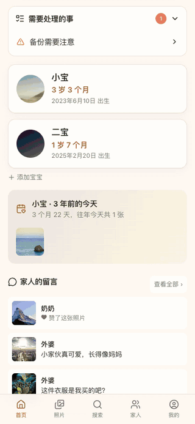
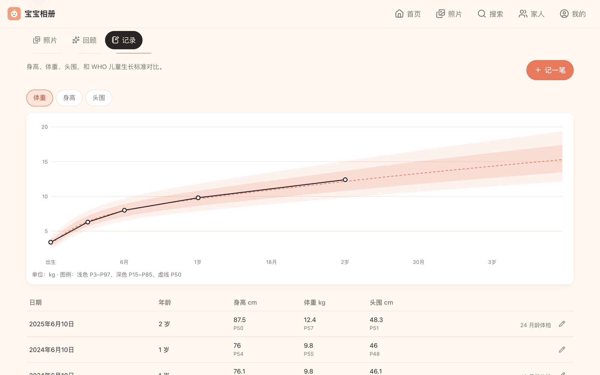
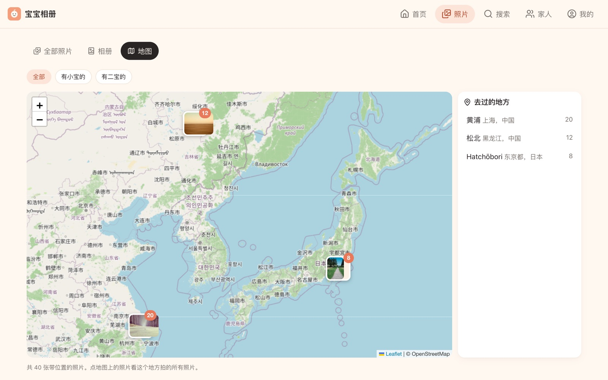
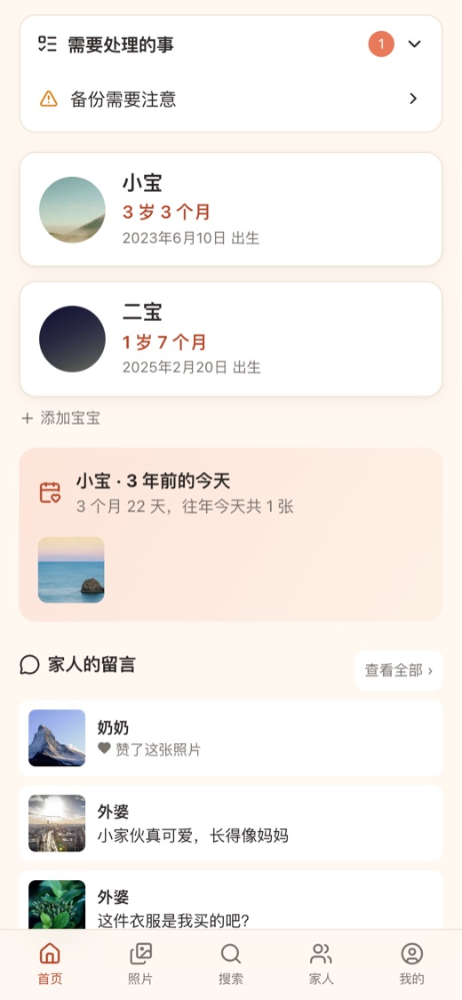
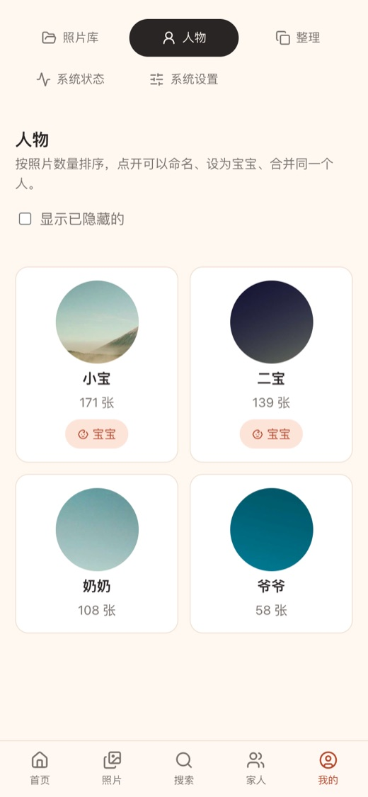

# 宝宝相册 BabyAlbum

[](https://github.com/tanner-sh/BabyAlbum/actions/workflows/ci.yml)
[](LICENSE)

**把 NAS 里多年积累的照片和视频，按宝宝的年龄自动整理成一本家庭相册。**

不用手动挑照片、建文件夹：人脸识别找出所有有宝宝的照片，按“3 个月”“1 岁 2 个月”排好；每个月、每一年自动挑精选，生日那天推送到手机；长辈点开一个链接就能看，还能点赞留言。照片始终留在原来的存储上，只读访问，不复制、不修改。

<p align="center">
  
  &nbsp;&nbsp;
  
  &nbsp;&nbsp;
  
</p>

## 特点

- **按年龄看**：时间线按月龄分组，“出生第 5 天”“1 岁 2 个月”，而不是一堆日期文件夹
- **自动认出宝宝**：人脸识别找出所有有宝宝的照片；宝宝从小到大长相变化大、被拆成好几个人物时，会提示合并
- **照片原地不动**：通过 SMB、NFS、WebDAV 只读访问 NAS、服务器或网盘，可以连好几个
- **全家一起看**：家人账号、免登录分享链接（可设密码、长辈模式）、点赞留言
- **像 App 一样用**：手机上添加到主屏幕；生日、满月、每周小结推送到手机
- **一条命令部署**：`docker compose up -d`，不需要配置文件，存储、成员、各项设置都在网页上完成
- **中文优先**：用中文搜照片（“在海边”“吃蛋糕”），地名显示中文，成长曲线对比 WHO 标准

后台用开源相册 [Immich](https://immich.app) 做扫描、缩略图、人脸识别和语义搜索。宝宝相册自动配置它，家人完全不用接触。

## 功能一览

### 按年龄整理


| | |
|---|---|
| **时间线** | 宝宝的照片和视频按月龄分组；可以只看宝宝和某位家人的合照，或者全家福 |
| **实况照片** | iPhone 的实况照片打开时自动播放一次，手机上长按播放 |
| **看大图** | 双指缩放、双击放大、左右滑切换、下滑关闭；收藏、下载原图、拍摄地点和设备 |
| **日期更正** | 自动找出日期明显不对的照片和视频（影楼设计页、相机时间没调、视频没有拍摄时间），按同一文件夹其他照片的日期一键更正，不改原文件 |

### 回顾与成长

<table>
  <tr>
    <td width="62%"></td>
    <td width="38%"></td>
  </tr>
</table>

| | |
|---|---|
| **精选回顾** | 每个月、每一年自动挑一组：优先收藏的、宝宝脸大的、分辨率高的，连拍只留一张，尽量每天（每月）都有；可以连起来播放 |
| **成长墙** | 每个月龄一张代表照片，连起来播放就是一段成长动画 |
| **那年今日** | 往年同一天的照片，首页提醒 |
| **同龄对比** | 几个宝宝在同一个月龄时的照片并排看（满月、百天、周岁……） |
| **里程碑、日记** | 第一次翻身、第一次走路；给某一天写几句话，和当天的照片放在一起 |
| **成长数据** | 身高、体重、头围的曲线，和 [WHO 儿童生长标准](https://www.who.int/tools/child-growth-standards/standards)（0–5 岁）的百分位对比 |
| **成长书** | 每个月的代表照片、里程碑、日记、成长数据排成一本书，用浏览器打印成 PDF |

### 找照片



| | |
|---|---|
| **搜索** | 用一句中文找照片：“在海边”“吃蛋糕”“荡秋千” |
| **地图** | 照片按拍摄地点聚在一起，点开看这个地方拍的所有照片；列出去过的地方，地名显示中文。底图可选 OpenStreetMap（默认）、天地图（需要免费申请 Key）、高德地图（自动换算坐标） |
| **相册** | 自己挑照片建相册（满月酒、第一次旅行），多选后一次加入，可以播放、设封面、单独分享 |

### 和家人一起

<table>
  <tr>
    <td width="68%"></td>
    <td width="32%"></td>
  </tr>
</table>

| | |
|---|---|
| **成员** | 管理员、家人、只读三种角色，可以限定只看某几个宝宝；邀请链接让家人自己注册 |
| **分享链接** | 免登录、只读，分享宝宝（对方只能看到有宝宝的照片）或者一个相册；可设有效期、访问密码、是否允许下载原图；给长辈的打开“长辈模式”，字和照片更大 |
| **点赞留言** | 家人和分享链接的访客都可以点赞、留言，家里人收到提醒 |
| **认识家里人** | 给常和宝宝一起出现的人起名字（奶奶、外公……），之后能看合照、找全家福 |

### 手机

<p>
  
  &nbsp;
  
  &nbsp;
  
</p>

底部 5 个入口：首页、照片、搜索、家人、我的。添加到主屏幕后像 App 一样全屏打开（PWA）。打开通知后可以收到：宝宝生日和满月的回顾、每周小结、家人的点赞留言，每一类都可以单独关掉。

### 管理

管理员在 **我的 → 管理** 里：

| | |
|---|---|
| **存储** | 连接 NAS、服务器或网盘（SMB、NFS、WebDAV），可以添加多个，断开后自动重连 |
| **照片库** | 浏览存储里的文件夹，勾选要导入的；导入进度：照片、视频各还剩多少，预计还要多久 |
| **人物** | 命名、设为宝宝、隐藏路人、合并同一个人（列出从没和 TA 同框过的人物，同一个人不会和自己同框） |
| **整理** | 疑似重复的照片，标出建议保留哪张；多余的在相册里隐藏，不删除存储上的文件，随时能恢复 |
| **系统状态** | 每 5 分钟检查照片服务、存储、网络连接（实际连一下推送和证书服务，能发现 DNS 污染）、HTTPS 证书、备份、磁盘、导入进度，出问题时推送提醒，首页也会显示 |
| **系统设置** | 视频转码、人脸识别、搜索模型、地图底图、处理速度、定时扫描、数据库备份 |

## 快速开始

需要一台能运行 Docker、常年开机的电脑（Mac mini、Linux 服务器、带 Docker 的 NAS 都可以），以及开启了 SMB / NFS / WebDAV 的存储。

```bash
git clone https://github.com/tanner-sh/BabyAlbum.git
cd BabyAlbum
docker compose up -d
```

打开 `http://<这台电脑的 IP>:3000`，创建管理员，然后按[首次使用](#首次使用)添加存储和宝宝。

## 部署

<details>
<summary><b>Mac（推荐 Mac mini，常年开机）</b></summary>

1. 安装 [OrbStack](https://orbstack.dev)，设置里勾选“登录时启动”。
2. 在 **系统设置 → 隐私与安全性 → 本地网络** 里允许 OrbStack，否则连不上局域网里的存储。
3. 在项目文件夹里运行 `docker compose up -d`。

作为常年运行的服务器，建议再设置一下：

```bash
sudo pmset -a sleep 0 disksleep 0     # 不睡眠（显示器可以照常关闭）
sudo pmset -a autorestart 1           # 停电恢复后自动开机
```

并在 **系统设置 → 用户与群组** 中开启自动登录，这样重启后所有服务都会自动启动。首次导入要从存储读取大量数据，建议用网线连接。

</details>

<details>
<summary><b>Linux / 带 Docker 的 NAS</b></summary>

```bash
docker compose up -d
```

直接部署在带 Intel 核显的 NAS 上时，新建 `.env` 写入下面一行，用核显做硬件转码，然后再启动：

```
COMPOSE_FILE=docker-compose.yml:docker-compose.nas.yml
```

照片就在这台 NAS 上时，添加存储的地址填 `127.0.0.1`。建议内存 16GB；缩略图和数据库放到 SSD 上会更快，见 `docker-compose.nas.yml` 里的注释。

</details>

<details>
<summary><b>让家人在外面也能看</b></summary>

在宝宝相册前面加一个 HTTPS 反向代理（NAS 自带的反向代理、Caddy、Nginx Proxy Manager 都行），只暴露 3000 端口。反向代理需要传递 `X-Forwarded-For` 和 `X-Forwarded-Proto`（常见反代默认都会），通过 HTTPS 访问时登录 Cookie 会自动加上 Secure 标记。

- 推送通知要求 HTTPS；iPhone 上还要先把宝宝相册添加到主屏幕。
- 家用宽带通常封了 80、443 端口，可以换成其他端口，证书用 DNS 验证签发（比如 Caddy 加上域名服务商的 DNS 插件）。
- 只给自己人用的话，也可以用 Tailscale 这类组网工具，不用暴露任何端口。

</details>

<details>
<summary><b>可选配置、升级</b></summary>

不建 `.env` 也能运行。需要修改端口、时区等时，复制 `.env.example` 为 `.env` 再改，每一项都有说明。

升级：

```bash
git pull
docker compose up -d --build
```

Immich 锁定在 v3 大版本。要升级 Immich 大版本前，先看它的 [更新说明](https://github.com/immich-app/immich/releases)。

</details>

## 首次使用

1. **创建管理员**：第一次打开网页时创建。宝宝相册会在后台自动初始化 Immich，大约需要一分钟。
2. **添加存储**（我的 → 管理 → 照片库）：选连接方式，填写地址和账号，点“测试连接”，成功后保存。
   - **SMB**：大多数 NAS、Windows、macOS 的共享文件夹。共享名就是在电脑上连接时看到的第一层共享文件夹。建议给宝宝相册单独建一个**只读账号**。
   - **NFS**：Linux 服务器、开启了 NFS 的 NAS。填共享路径（比如 `/volume1/photos`），并在 NFS 设置里允许这台设备的 IP。
   - **WebDAV**：网盘或开启了 WebDAV 的服务器。填完整地址（比如 `https://dav.example.com/dav`）。读取大量照片和视频比较慢，首次导入会花更长时间。
3. **设置备份位置**（同一页）：选一个存储上可写的文件夹，数据库每天自动备份到那里。
4. **添加照片库**：浏览存储，勾选存放照片的文件夹，保存后自动开始扫描。照片很多时，建议先选一两个文件夹试一下。
5. **添加宝宝**：人脸识别有结果后，首页会问“发现一个出现在 N 张照片里的人物，是宝宝吗？”，填写名字和生日，顺便把可能也是宝宝的其他人物合并进来。之后首页会提示给常一起出现的家人起名字。
6. **邀请家人**（家人 → 成员）：生成邀请链接，可以选角色、限定只看哪个宝宝。给长辈的可以在 **家人 → 分享链接** 里建一个免登录的链接。

处理速度参考：几百张照片几分钟；几万张照片和视频大约一天（只在第一次导入时这么久，之后只处理新照片）。

## 常见问题

<details>
<summary><b>连不上存储？</b></summary>

“测试连接”会给出具体原因。常见的：SMB 没开启或账号密码不对；NFS 没有允许这台设备的 IP；WebDAV 地址不完整。宝宝相册运行在 Mac 上时，还要在“本地网络”权限里允许 OrbStack。

</details>

<details>
<summary><b>视频播放不了？</b></summary>

为了节省时间和空间，默认**不转码**，由浏览器直接播放原视频。苹果设备和 Mac 上的 Chrome 都能播放手机常见的 HEVC 视频；部分安卓手机、微信内置浏览器可能不行。需要的话在 **我的 → 管理 → 系统设置 → 视频** 里打开转码（会比较耗时间和空间）。

</details>

<details>
<summary><b>推送收不到？</b></summary>

先看 **我的 → 管理 → 系统状态 → 网络连接**：它会实际连一下推送服务。在国内，谷歌的推送服务（安卓手机、电脑上的 Chrome）通常连不上；iPhone 用的苹果推送一般没问题。iPhone 上要先把宝宝相册添加到主屏幕，再从主屏幕打开、开启通知。

</details>

<details>
<summary><b>新拍的照片怎么进来？</b></summary>

放到存储上已导入的文件夹里，定时扫描（默认每天一次）后自动出现，也可以在照片库页面手动扫描。

</details>

<details>
<summary><b>照片日期不对？</b></summary>

- 日期早于出生之类明显错误的，宝宝页面会提示，一键更正即可（只在宝宝相册里生效，不改原文件）。
- 微信保存的图片等没有拍摄时间的照片，可以用 `scripts/fix-mtime.ts` 按文件名里的时间修正（只改文件修改时间，默认只预览）：
  ```bash
  docker run --rm -v /照片目录:/photos -v "$PWD/scripts:/s:ro" node:24-alpine node /s/fix-mtime.ts /photos          # 预览
  docker run --rm -v /照片目录:/photos -v "$PWD/scripts:/s:ro" node:24-alpine node /s/fix-mtime.ts /photos --apply  # 执行
  ```

</details>

<details>
<summary><b>部署前想先看看 NAS 上有多少照片？</b></summary>

`scripts/inventory.ts` 会统计文件数量、格式、大小、重复文件，并估算需要的缓存空间。只读，不改任何文件：

```bash
docker run --rm -v /照片目录:/photos:ro -v "$PWD/scripts:/s" node:24-alpine node /s/inventory.ts /photos --out /s/report.json
```

</details>

<details>
<summary><b>忘记密码？</b></summary>

家人忘记密码由管理员在 **家人 → 成员** 里重置。管理员忘记密码，在服务器上运行：

```bash
docker compose exec baby-server node --disable-warning=ExperimentalWarning src/cli/reset-password.ts <用户名> <新密码>
```

</details>

<details>
<summary><b>数据存在哪里？</b></summary>

- 照片：始终在原来的存储上，只读访问。
- 缩略图、数据库：在运行宝宝相册的电脑上（Docker 数据卷）。
- 日记、成长数据、里程碑、留言：在宝宝相册自己的数据库里，每天自动备份到设置的文件夹。存储的账号密码也在数据库里，会随备份一起保存，请妥善保管备份文件夹。

</details>

## 架构

```
 存储（SMB / NFS / WebDAV，可多个）
   │ 只读
   ▼
 nas-mounter ──挂载──▶ Immich（扫描、缩略图、人脸识别、搜索）
 （挂载服务）              │ API
                          ▼
                     baby-server（宝宝相册：网页 + API） ◀── 浏览器 / 手机 :3000
```

| 服务 | 作用 |
|---|---|
| `baby-server` | 宝宝相册的网页和后端，唯一对外开放的服务。管理用户、权限、宝宝档案、日记等，并在后台配置 Immich |
| `nas-mounter` | 按宝宝相册的指令挂载存储（SMB、NFS 由内核挂载，WebDAV 用 rclone）。挂载需要系统权限，所以单独成一个容器，不对外开放端口 |
| `immich-server`、`immich-machine-learning` | Immich 官方镜像，只在内部使用，不对外开放端口 |
| `database`、`redis` | Immich 的数据库和缓存 |

宝宝相册通过 API 使用 Immich，不修改它的代码，也不直接读写它的数据库。

<details>
<summary><b>项目结构</b></summary>

```
BabyAlbum/
├── docker-compose.yml        # 全部服务
├── docker-compose.nas.yml    # 部署在带 Intel 核显的 NAS 上时叠加（硬件转码）
├── docker-compose.dev.yml    # 本机测试时叠加
├── .env.example              # 可选配置
├── baby-server/              # 后端（TypeScript + Fastify + SQLite，Node 24 直接运行 .ts）
│   ├── src/
│   │   ├── routes/           # 接口：相册、管理、分享、手动相册
│   │   ├── mounter/          # 挂载服务
│   │   ├── album.ts          # 时间线、成长墙、那年今日、回顾选片、搜索、实况照片
│   │   ├── auth.ts           # 登录、角色权限、邀请
│   │   ├── family.ts         # 认识家里人、合照、全家福
│   │   ├── map.ts、geo.ts    # 地图、地名翻成中文
│   │   ├── health.ts         # 系统状态检查和提醒
│   │   ├── push.ts           # 手机推送
│   │   ├── import-progress.ts # 导入进度和剩余时间估算
│   │   ├── immich-link.ts    # 自动接入 Immich
│   │   ├── nas.ts            # 存储连接管理
│   │   └── db.ts             # 数据库
│   ├── scripts/              # 测试数据生成
│   └── test/                 # 单元测试
├── baby-web/                 # 前端（React + Vite）
├── tests/                    # 端到端测试（接口 + 界面）
├── docs/screenshots/         # README 里的截图
└── scripts/
    ├── inventory.ts          # NAS 照片盘点工具
    ├── fix-mtime.ts          # 按文件名修正照片日期的工具
    ├── who-growth.py         # 从 WHO 官网的表格生成成长曲线数据
    ├── geo-names.py          # 从 GeoNames 生成地名的中文对照
    ├── dev-up.sh             # 一键启动本机测试环境
    ├── dev-fixtures.sh       # 补充测试数据（GPS、实况照片、日期有问题的视频）
    └── test-e2e.sh           # 端到端测试
```

</details>

## 开发

需要 Node.js 24 以上、Docker 和 ffmpeg（生成测试照片用）。

```bash
./scripts/dev-up.sh           # 启动本机测试环境：生成测试照片（两个宝宝，约三年），启动所有服务并初始化
./scripts/dev-fixtures.sh     # 补充测试数据：带 GPS 的照片、实况照片、日期有问题的视频
```

完成后打开 http://localhost:3000，账号密码在 `dev-data/dev-credentials.json`。

```bash
# 后端：Node 直接运行 .ts，没有构建步骤
cd baby-server && npm install
npm run dev          # 开发模式（需要能访问 Immich，IMMICH_URL 默认 http://localhost:2283）
npm run typecheck && npm test

# 前端：Vite 开发服务器，/api 代理到 localhost:3000
cd baby-web && npm install
npm run dev
npm run typecheck
```

**测试**

```bash
cd baby-server && npm test        # 单元测试
./scripts/test-e2e.sh --fresh     # 端到端测试：启动测试环境、补充测试数据，跑接口测试和界面测试（需要 Chrome）
./scripts/test-e2e.sh             # 测试环境已经起来时，直接跑测试
```

每次推送到 GitHub 都会自动跑这些测试（[`.github/workflows/ci.yml`](.github/workflows/ci.yml)）。测试环境默认不开机器学习，语义搜索相关的检查会跳过。

## 许可证与致谢

[GNU Affero General Public License v3.0](LICENSE)（AGPL-3.0）：可以自由使用、修改和分发；修改后的版本如果通过网络提供给别人使用，也必须以同样的许可证公开源代码。

- [Immich](https://github.com/immich-app/immich)（AGPL-3.0）：照片扫描、人脸识别、语义搜索。通过 API 调用它的官方 Docker 镜像，没有包含或修改它的源代码。
- 成长曲线：[WHO 儿童生长标准](https://www.who.int/tools/child-growth-standards/standards)（2006）的 LMS 参数，由 `scripts/who-growth.py` 生成。
- 地名中文对照：[GeoNames](https://www.geonames.org/)（CC BY 4.0），由 `scripts/geo-names.py` 生成。
- 地图：[Leaflet](https://leafletjs.com)，底图 © [OpenStreetMap](https://www.openstreetmap.org/copyright) 贡献者。
- README 截图里的示例照片来自 [Unsplash](https://unsplash.com)（通过 [Lorem Picsum](https://picsum.photos)），宝宝和家人的名字都是测试数据。
